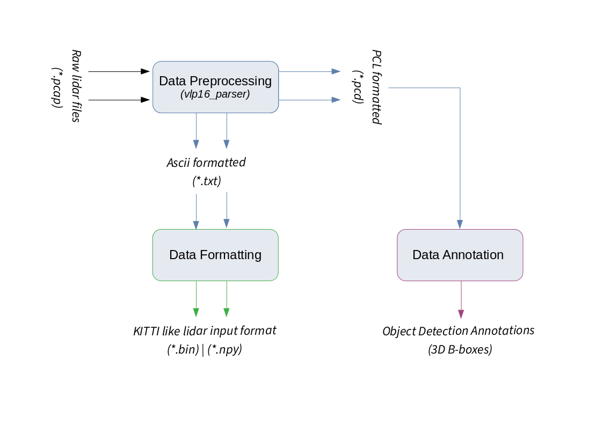

# Lidar Data Analysis

**Raw Input**

Velodyne Puck Capture (`x.pcap`)

**Modules**

- [[Data Preprocessing](./preprocessing/)]
- [[Data Formatting](./transforms/)]
- [[Data Visualization ](./visualization)]
- [[ROS Modules](./ros_modules/)]

**Information Flow**

**Output**

- KITTI format compatible Lidar format : (`x.bin`)
- Files for Annotation: (`subset_of_x.pcd`)

**References**

1. https://gitlab.com/jimquery/pcap-parse/-/tree/master
2. https://gist.github.com/SebastianGrans/6ae5cab66e453a14a859b66cd9579239
3. https://github.com/ArashJavan/veloparser
4. https://github.com/majaime/LiDAR-Data-Processing-open3d
