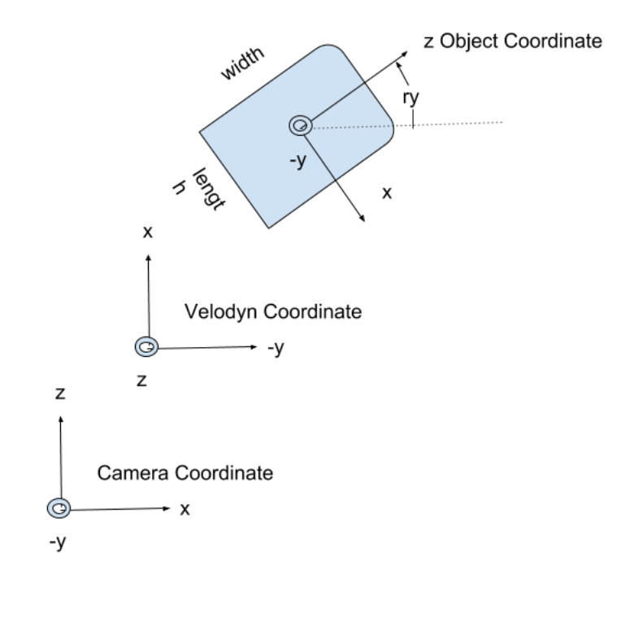

# KITTI 3D Object Detection Dataset

```
.
├── data
│   └── kitti
│      │── ImageSets [ Train/Test/Val set split]
|      |   |── train.txt
|      |   |── test.txt
|      |   └── val.txt
│      │── training
│      │   ├──velodyne
│      │   |  |──000000.bin
│      │   |  └── ... *.bin
│      │   ├──calib
│      │   |  |──000000.txt
│      │   |  └── ... *.txt
│      │   ├──image_2
│      │   |  |──000000.png
│      │   |  └── ... *.png
│      │   ├──label_2
│      │   |  |──000000.txt
│      │   |  └── ... *.txt
│      │   └──(optional for augmentation: planes & depth_2)
│      └─── testing
│          ├──velodyne
│          |  |──000000.bin
│          |  └── ... *.bin
│          ├──calib
│          |  |──000000.txt
│          |  └── ... *.txt
│          └──image_2
│             |──000000.png
│             └── ... *.png
```

## File Types:

**Camera_2 Image**: 000001.png

- Left-Camera RGB images

**Camera_2 label**: 000001.txt

- Object bounding boxes in 2D and 3D
- 2D bounding boxes are in terms of pixels in the camera image.
- The 3D bounding boxes are in 3 co-ordinates
- The (H, W, D) are in object co-ordinates system
- The center of the bounding vox is in the camera coordinate

**Calibration**: 000001.txt

It contains the values of 6 matrices 
- `P0–3`, `R0_rect`, `Tr_velo_to_cam`, and `Tr_imu_to_velo`.
- The `Px` matrices project a point in the rectified referenced camera coordinate to the `camera_x image`. Camera_0 is the reference camera coordinate
- `R0_rect` is the rectifying rotation for reference coordinate(rectification makes images of multiple cameras lie on the same plan)
- `Tr_velo_to_cam` maps a point in a point cloud coordinate to reference coordinate.

**Lidar Point Cloud**: 000001.bin

- The point cloud file contains the location of a point and it's reflectance in the lidar-coordinate.

**Co-ordinate Systems used in dataset**




## References

- https://seagrant.mit.edu/auvlab-datasets-marine-perception-1/
- https://medium.com/test-ttile/kitti-3d-object-detection-dataset-d78a762b5a4
- https://towardsdatascience.com/kitti-coordinate-transformations-125094cd42fb
- https://towardsdatascience.com/lidar-3d-object-detection-methods-f34cf3227aea
